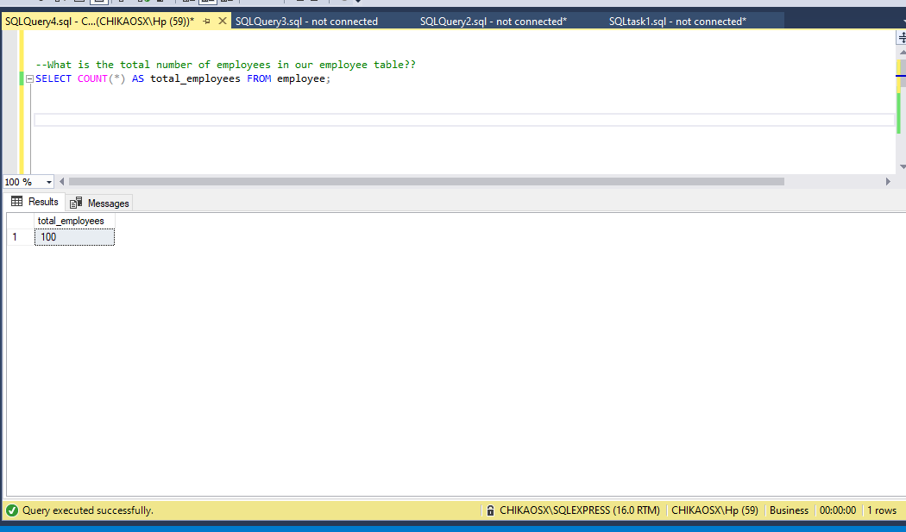
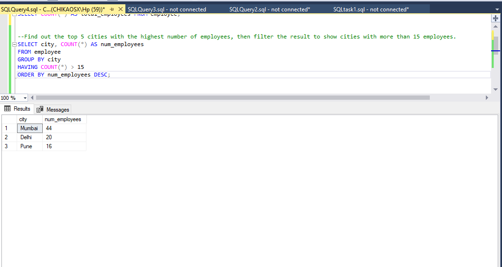
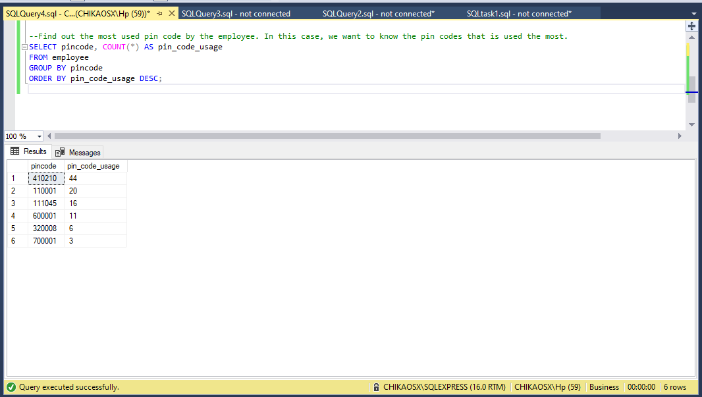

# **SQL Queries Report: Employee and Salary Analysis**


**Introduction:**

This report provides an overview of SQL queries performed on an employee and salary database. The database contains employee information such as names, cities, dates of birth, and email addresses, as well as salary details. The queries focus on filtering and analyzing this data to extract valuable insights.

**Query 1: Filtering by City**

The first query aimed to retrieve employee data from the database based on their city of residence. The SQL query used the `IN` operator to filter for employees located in Mumbai and Delhi. This query allows for identifying employees in these specific cities, potentially for regional analysis or targeted communication.
```
SELECT * FROM employee WHERE city IN ('Mumbai', 'Delhi');
```


**Query 2: Name Pattern Matching**

The second query focused on extracting employees whose first names contained both 'a' and 'e'. By utilizing the `LIKE` operator with wildcards, the database was queried for names meeting this specific pattern. This type of analysis could be used for identifying names that share certain characteristics, which might be of interest for various purposes, such as naming trends.
```
SELECT * FROM employee WHERE fname LIKE '%a%' AND fname LIKE '%e%';
```


**Query 3: Date of Birth Analysis**

The third query involved selecting employees based on their date of birth. The query filtered out employees born after the year 1990, using the `YEAR` function to extract the birth year from the date of birth. This analysis could be useful for demographic studies or for identifying younger employees in the organization.
```
SELECT * FROM employee WHERE YEAR(date_of_birth) > 1990;
```


**Query 4: Salary Insights**

The fourth query was focused on the salary table. It aimed to extract salary data below 1 million and sort it in ascending order. This query allows for examining salary distribution, identifying potential outliers, or understanding the range of compensation within the organization.
```
SELECT * FROM salary WHERE Base < 1000000 ORDER BY Base ASC;
```


**Query 5: Email Manipulation**

The final query was an update statement that modified the email addresses of employees. It removed the domain '@gmail.com' from the email addresses. This action could be performed for various reasons, such as standardizing email addresses or preparing data for integration with other systems.
```
UPDATE employee
SET email = SUBSTRING(email, 1, LEN(email) - 10)
WHERE email LIKE '%@gmail.com';
```


**Query 6: Total Number of Employees**

The query focused on determining the total number of employees in the database. By employing the COUNT function, we obtained an accurate count of all employees. This simple yet essential statistic serves as a foundational element for understanding the scale of our employee dataset.
```
SELECT COUNT(*) AS total_employees FROM employee;
```


**Query 7: Top Cities with Employee Distribution**

This query delved into identifying the top cities with the highest number of employees. This involved grouping employees by their respective cities, counting the employees in each group, and sorting them in descending order. To provide a more insightful view, the result was filtered to display only cities with more than 15 employees.
```
SELECT city, COUNT(*) AS num_employees
FROM employee
GROUP BY city
HAVING COUNT(*) > 15
ORDER BY num_employees DESC;
```


**Query 8: Most Used Pin Code**

The third query aimed to uncover the most frequently used pin code among employees. By grouping employees based on pin codes and tallying the occurrences, we identified the pin code that was most commonly associated with employees.
```
SELECT pincode, COUNT(*) AS pin_code_usage
FROM employee
GROUP BY pincode
ORDER BY pin_code_usage DESC;
```



**Conclusion:**

The SQL queries performed on the employee and salary database provided valuable insights and allowed for data extraction and manipulation. These queries demonstrated how SQL can be used to filter and analyze data based on specific criteria, revealing patterns, trends, and anomalies within the dataset. The results of these queries can be leveraged for strategic decision-making, data cleaning, and further analysis in a business context.

Through the power of SQL queries, we've gained valuable insights into our employee database. The analysis has provided us with information about the total number of employees, the distribution of employees across key cities, and the most frequently used pin code. These insights can guide decisions related to resource allocation, targeted initiatives, and understanding our employee base more comprehensively.


